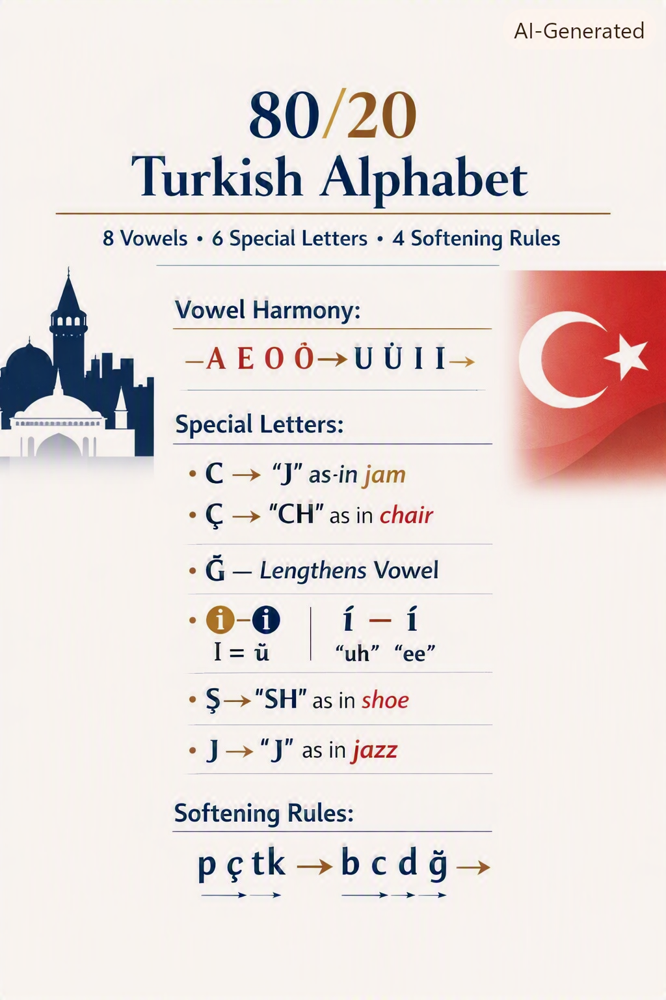
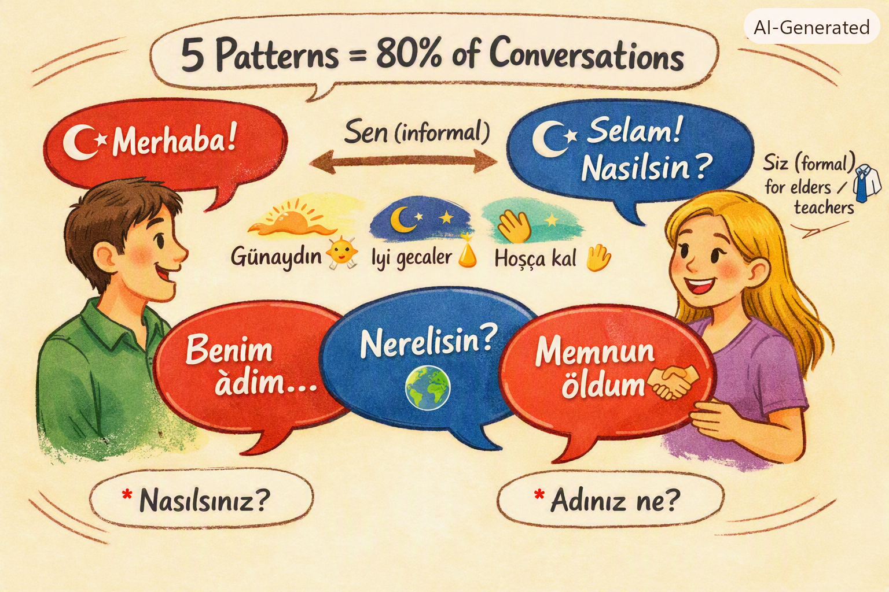
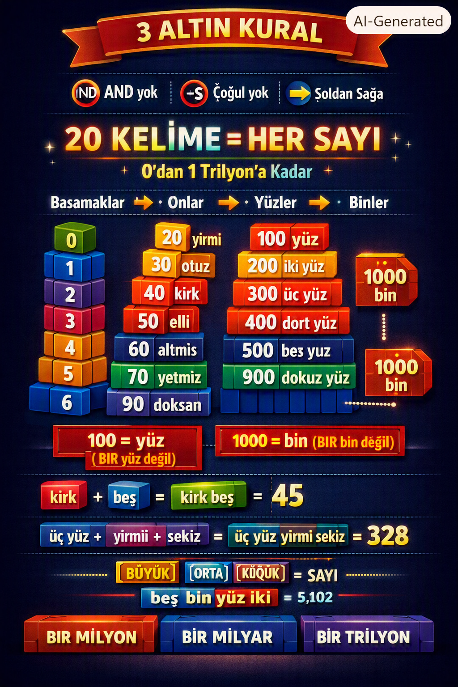
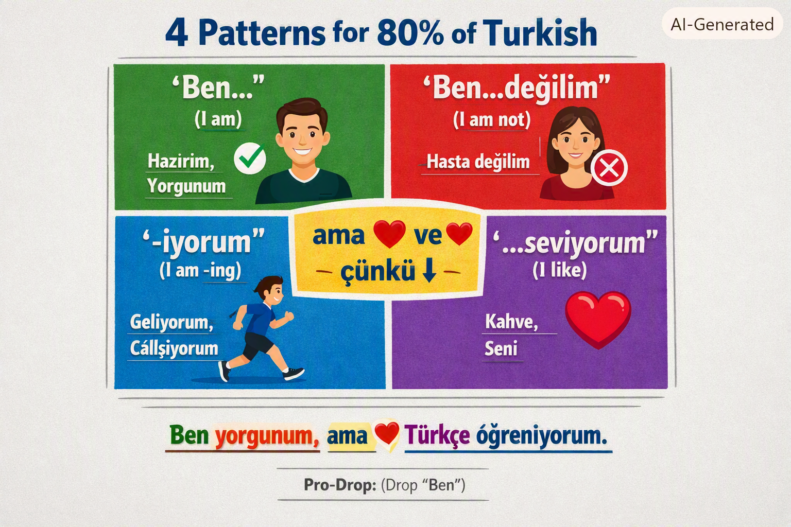
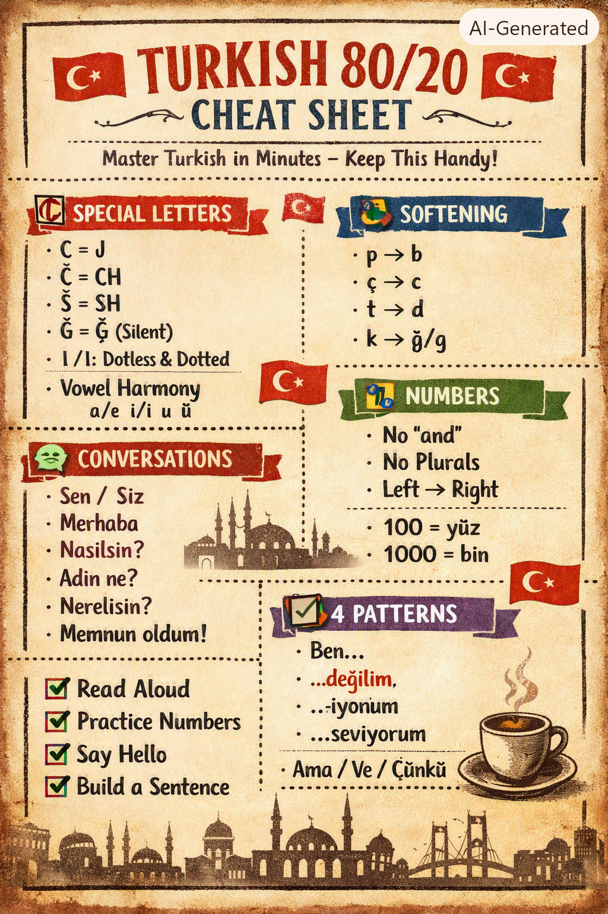

Here is the clean, refined, and ready-to-use `README.md` content. You can simply copy everything inside the code block below and paste it directly into your `README.md` file.


# 🇹🇷 Turkish 80/20 Learning Guide - Day 2

## Master Turkish with the Pareto Principle

> **"Focus on the 20% that gives you 80% of the results"**

---

## 📚 Day 2 Contents

This folder contains the essential Turkish learning materials structured around the **80/20 Rule**. Master these fundamentals to speak Turkish confidently!

---

## 🖼️ Visual Cheat Sheets

### 1️⃣ Alphabet & Pronunciation


**Key Takeaways:**
- 8 Vowels with vowel harmony rules
- 6 Special Letters (C, Ç, Ğ, I, İ, Ş)
- 4 Softening Rules (p→b, ç→c, t→d, k→ğ/g)
- Dotless I (I/ı) vs Dotted İ (İ/i)

---

### 2️⃣ Conversations & Greetings


**Key Takeaways:**
- 5 Essential Conversation Patterns
- Sen (informal) vs Siz (formal) distinction
- Common greetings and responses
- Introduction phrases

---

### 3️⃣ Numbers & Counting


**Key Takeaways:**
- 3 Golden Rules (No "and", No plurals, Left→Right)
- 20 Base Words = ANY Number
- 100 = yüz (NOT bir yüz!)
- 1000 = bin (NOT bir bin!)
- Build numbers up to 1 trillion

---

### 4️⃣ Sentence Patterns


**Key Takeaways:**
- 🟢 Pattern 1: Ben... (I am)
- 🔴 Pattern 2: ...değilim (I am not)
- 🔵 Pattern 3: ...-iyorum (I am -ing)
- 🟣 Pattern 4: ...seviyorum (I like)
- Connectives: ama (but), ve (and), çünkü (because)

---

### 5️⃣ Master Cheat Sheet


**One-Page Summary of Everything:**
- Special Letters
- Softening Rules
- Conversation Starters
- Number Rules
- 4 Patterns
- Quick Reference for daily use

---

## 📁 File Structure

```text
day002/
├── README.md              # This file
├── images/
│   ├── 1.png              # Alphabet Poster
│   ├── 2.png              # Conversation Guide
│   ├── 3.png              # Number Builder
│   ├── 4.png              # 4 Patterns Poster
│   └── 5.png              # Master Cheat Sheet
├── alphabet.md            # Full alphabet guide
├── draft-chatgpt.md       # Arabic translation guide
├── istanbul-book.md       # TÖMER A1 Lesson 3
├── numbers.md             # Complete numbers guide
├── patterns-exercises.md  # Sentence pattern exercises
└── personal-draft.md      # 40 practical sentences
```

---

## 🚀 Quick Start Guide

### If you're brand new:
1. 📖 Read `alphabet.md` first
2. 💬 Practice with `istanbul-book.md`
3. 🔢 Learn `numbers.md`
4. 📝 Master the 4 patterns

### If you want to speak fast:
1. 🖼️ Study images 1-5
2. 💬 Practice conversations from image 2
3. 📝 Use patterns from image 4
4. 🔄 Keep image 5 as your cheat sheet

### If you're an Arabic speaker:
1. 🌍 Start with `draft-chatgpt.md`
2. 📖 Then follow the main guides

---

## 🎯 The 80/20 Core Concepts

### Alphabet (20% of letters = 80% of pronunciation)
| Letter | Sound | Example |
|--------|-------|---------|
| C | "J" as in jam | cam (glass) |
| Ç | "CH" as in chair | çay (tea) |
| Ğ | Silent, lengthens vowel | dağ → "daa" |
| I/ı | "uh" as in open | kız (girl) |
| İ/i | "ee" as in see | iyi (good) |
| Ş | "SH" as in shoe | şeker (sugar) |

### Vowel Harmony (2 rules = 80% accuracy)
| Rule | When | Example |
|------|------|---------|
| 2-Way (a/e) | Last vowel a, ı, o, u → a | kitap + lar = kitaplar |
| | Last vowel e, i, ö, ü → e | ev + ler = evler |
| 4-Way (ı/i/u/ü) | Based on last vowel | dal + ım, ev + im, yol + um, göz + üm |

### Numbers (3 rules + 20 words = ALL numbers)
1. No "AND" (yüz beş = 105)
2. No Plurals (iki bin = 2000)
3. Left → Right (beş bin yüz iki = 5,102)

### 4 Sentence Patterns (4 patterns = 80% of sentences)
| Pattern | Example | English |
|---------|---------|---------|
| Ben... | Ben yorgunum | I am tired |
| ...değilim | Hasta değilim | I am not sick |
| ...-iyorum | Çalışıyorum | I am working |
| ...seviyorum | Kahve seviyorum | I like coffee |

---

## 💡 Pro Tips

1. **Read Turkish Exactly as Written:** No silent letters (except Ğ). Every letter has a consistent sound.
2. **Drop "Ben" (I) When Natural:** Turkish is "pro-drop". The verb ending already shows "I".
3. **Master Sen vs Siz:** **Sen** = informal (friends, children). **Siz** = formal (teachers, elders, strangers).
4. **Stress Falls on Last Syllable:** merhaba = mehr-hah-**BAH** (Exception: Place names).
5. **Numbers Are Logical:** Learn 20 base words, follow 3 rules, and you can build ANY number.

---

## 📖 Suggested Study Path

### Day 2 Tasks:
- [ ] Study `1.png` (Alphabet Poster)
- [ ] Study `2.png` (Conversation Guide)
- [ ] Study `3.png` (Number Builder)
- [ ] Study `4.png` (4 Patterns Poster)
- [ ] Print or save `5.png` as your cheat sheet

### Practice:
- [ ] Read `alphabet.md` in detail
- [ ] Practice conversations from `istanbul-book.md`
- [ ] Do number exercises from `numbers.md`
- [ ] Complete exercises in `patterns-exercises.md`
- [ ] Use `personal-draft.md` for example sentences

---

## 🎯 Quick Reference

```text
🇹🇷 TURKISH 80/20 CHEAT SHEET

🔤 SPECIAL LETTERS
C=J · Ç=CH · Ş=SH · Ğ=(silent) · I/İ distinction · Vowel Harmony

💬 CONVERSATIONS (5 Patterns)
Merhaba · Nasılsın? · Adın ne? · Nerelisin? · Memnun oldum
Sen (informal) · Siz (formal)

🔢 NUMBERS (3 Rules)
No "and" · No plurals · Left→Right
100 = yüz · 1000 = bin (NO "bir" before them!)

📝 4 PATTERNS
🟢 Ben... (I am)
🔴 ...değilim (I am not)
🔵 ...-iyorum (I am -ing)
🟣 ...seviyorum (I like)

🔗 Connectives: ama (but) · ve (and) · çünkü (because)
```

---

## 🤝 How to Use This

1. **Read the images first** - They're visual summaries.
2. **Deep dive into .md files** - For detailed explanations and exercises.
3. **Practice, practice, practice** - Use the exercises provided.
4. **Keep image 5 handy** - It's your master cheat sheet for daily use.

---

## 📚 Related Files

| File | What It Covers |
|------|----------------|
| `alphabet.md` | Complete alphabet with pronunciation rules |
| `draft-chatgpt.md` | Arabic-translated basics for native Arabic speakers |
| `istanbul-book.md` | TÖMER A1 Lesson 3 conversations and exercises |
| `numbers.md` | Complete numbers guide with practice exercises |
| `patterns-exercises.md` | Sentence pattern mixing practice |
| `personal-draft.md` | 40 practical, high-frequency example sentences |

---

## 🎉 Congratulations!

You've completed Day 2 of your Turkish learning journey!

**Remember:**
- ✅ Focus on the 20% that gives 80% of the results.
- ✅ Practice daily, even 5 minutes helps.
- ✅ Use the images as quick reference guides.
- ✅ Don't try to memorize everything at once; consistency is key.

**İyi çalışmalar!** (Happy studying!) 🇹🇷

---
*Created with ❤️ for Turkish learners everywhere*
