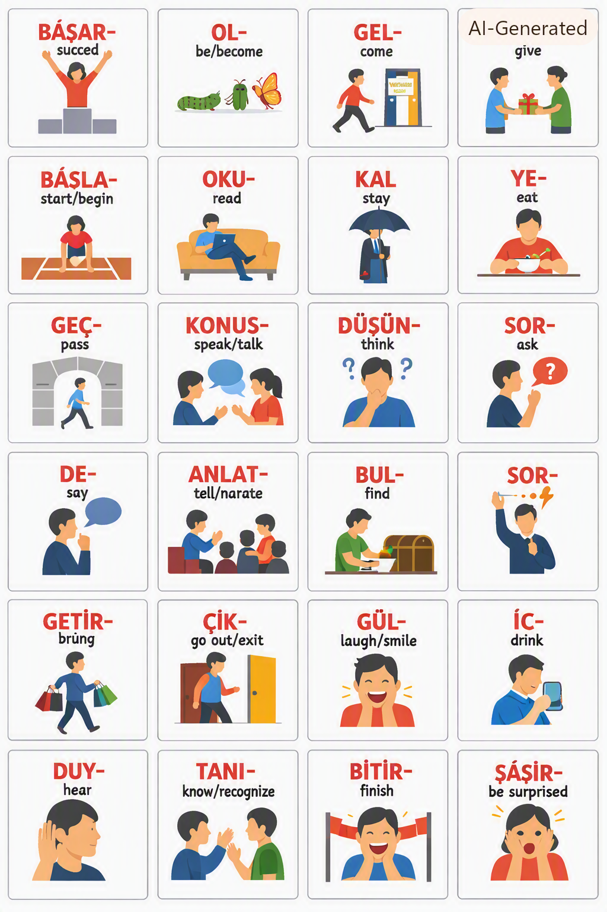
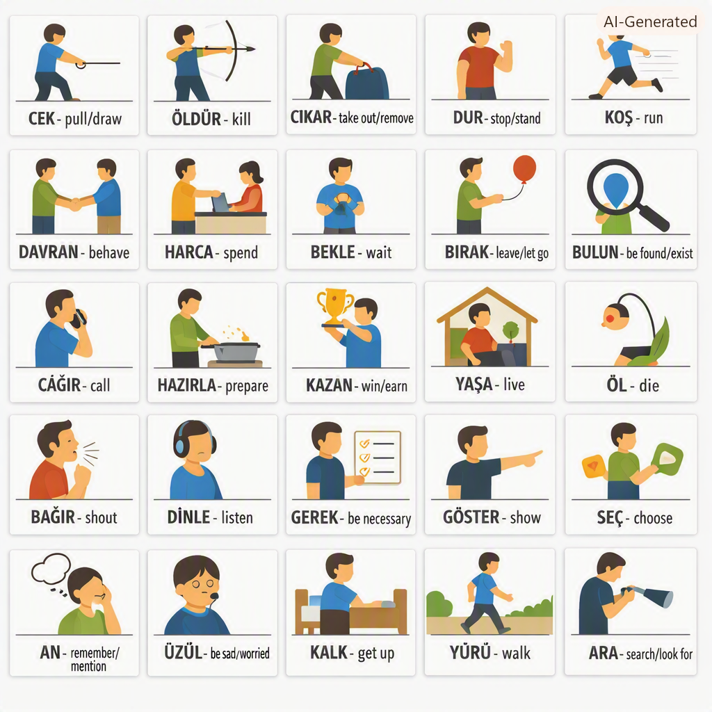
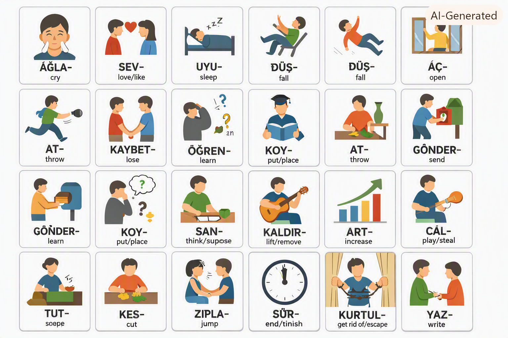
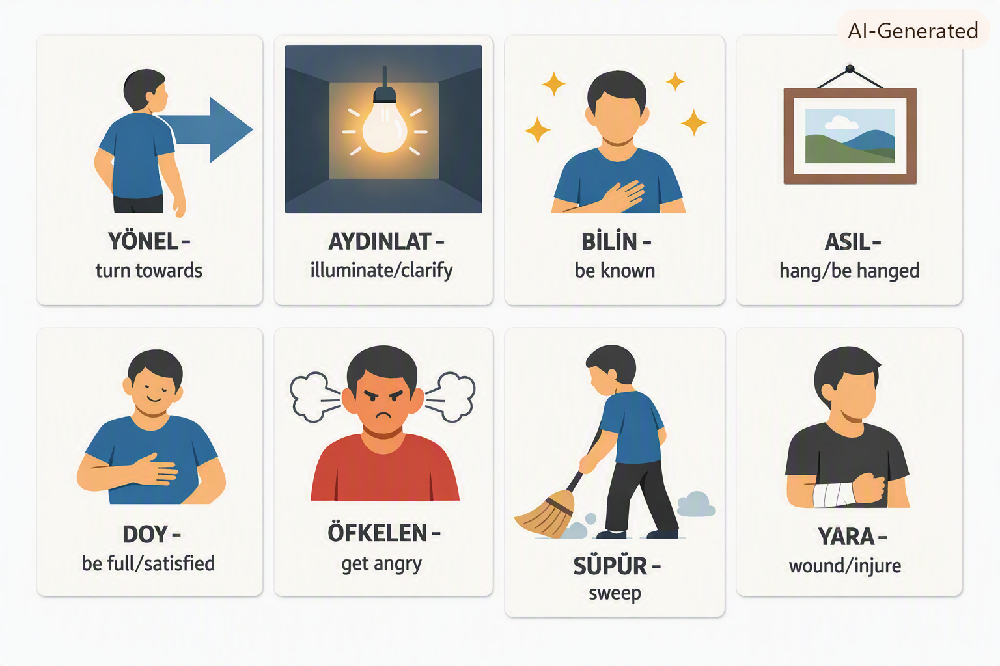

# 📚 Day 003 - Turkish A1 & A2 Verbs with Visual Flashcards

## 🎯 Today's Learning Goals

- ✅ Learn 17 essential **A1 Turkish verbs**
- ✅ Learn 125 **A2 Turkish verbs** with visual flashcards
- ✅ Practice verb conjugation patterns
- ✅ Build vocabulary through visual learning

---

## 📁 Directory Structure

```
day003/
├── images/
│   ├── 1.png     # OTUR- (sit)
│   ├── 2.png     # GİR- (enter)
│   ├── 3.png     # GEZ- (wander/travel)
│   ├── 4.png     # BULUŞ- (meet)
│   └── 5.png     # SAT- (sell)
├── istanbul-a1-exercises.md    # A1 exercises from Istanbul textbook
├── istanbul-content.md         # Istanbul textbook content
├── verbs-a1-a2.md              # Complete A1 & A2 verb list
└── README.md                   # This file
```

---

## 🖼️ Visual Flashcards (A1 Verbs)

| # | Image | Turkish | English | Frequency |
|---|-------|---------|---------|-----------|
| 1 |  | **OTUR-** | sit | 1 |
| 2 |  | **GİR-** | enter | 1 |
| 3 |  | **GEZ-** | wander / travel | 1 |
| 4 |  | **BULUŞ-** | meet | 1 |
| 5 |  | **SAT-** | sell | 1 |

---

## 📊 A1 Verbs Complete List

| # | Turkish | English | Frequency |
|---|---------|---------|-----------|
| 1 | **OTUR-** | sit | 1 |
| 2 | **GİR-** | enter | 1 |
| 3 | **GEZ-** | wander/travel | 1 |
| 4 | **BULUŞ-** | meet | 1 |
| 5 | **SAT-** | sell | 1 |
| 6 | **GİT-** | go | 5 |
| 7 | **BAK-** | look | 4 |
| 8 | **BİL-** | know | 4 |
| 9 | **ET-** | do/make | 3 |
| 10 | **İSTE-** | want | 3 |
| 11 | **SÖYLE-** | say/tell | 3 |
| 12 | **BUYUR-** | order/command | 3 |
| 13 | **GÖR-** | see | 2 |
| 14 | **GÖRÜŞ-** | meet/see each other | 2 |
| 15 | **YAP-** | do/make | 1 |
| 16 | **AL-** | take/buy | 1 |
| 17 | **DÖN-** | return/turn | 1 |

---

## 🟡 A2 Verbs (Top 20 Most Frequent)

| # | Turkish | English | Frequency |
|---|---------|---------|-----------|
| 1 | **BAŞAR-** | succeed | 529 |
| 2 | **OL-** | be/become | 131 |
| 3 | **GEL-** | come | 64 |
| 4 | **VER-** | give | 51 |
| 5 | **BAŞLA-** | start/begin | 33 |
| 6 | **OKU-** | read | 31 |
| 7 | **KAL-** | stay | 28 |
| 8 | **YE-** | eat | 28 |
| 9 | **GEÇ-** | pass | 27 |
| 10 | **KONUŞ-** | speak/talk | 27 |
| 11 | **DÜŞÜN-** | think | 24 |
| 12 | **SOR-** | ask | 21 |
| 13 | **DE-** | say | 18 |
| 14 | **ANLAT-** | tell/narrate | 17 |
| 15 | **BUL-** | find | 16 |
| 16 | **ÇALIŞ-** | work/study | 16 |
| 17 | **GETİR-** | bring | 16 |
| 18 | **ÇIK-** | go out/exit | 15 |
| 19 | **GÜL-** | laugh/smile | 14 |
| 20 | **İÇ-** | drink | 13 |

---

## 🔤 Verb Conjugation Pattern

### Present Tense (Şimdiki Zaman)

| Person | Suffix | Example: GİT- (to go) |
|--------|--------|----------------------|
| Ben (I) | -yorum | **Gidiyorum** (I go) |
| Sen (You - sg) | -yorsun | **Gidiyorsun** (You go) |
| O (He/She/It) | -yor | **Gidiyor** (He/She/It goes) |
| Biz (We) | -yoruz | **Gidiyoruz** (We go) |
| Siz (You - pl) | -yorsunuz | **Gidiyorsunuz** (You go) |
| Onlar (They) | -yorlar | **Gidiyorlar** (They go) |

---

## 📝 Verb Group Categories

### 🔵 Action Verbs (Hareket Fiilleri)

| Turkish | English |
|---------|---------|
| GİT- | go |
| GEL- | come |
| KOŞ- | run |
| YÜRÜ- | walk |
| ZIPLA- | jump |

### 🟢 Communication Verbs (İletişim Fiilleri)

| Turkish | English |
|---------|---------|
| KONUŞ- | speak/talk |
| SÖYLE- | say/tell |
| ANLAT- | tell/narrate |
| SOR- | ask |
| BAĞIR- | shout |

### 🔴 Feeling Verbs (Duygu Fiilleri)

| Turkish | English |
|---------|---------|
| GÜL- | laugh/smile |
| AĞLA- | cry |
| ÜZÜL- | be sad |
| ŞAŞIR- | be surprised |
| SEV- | love/like |

### 🟡 Daily Life Verbs (Günlük Hayat Fiilleri)

| Turkish | English |
|---------|---------|
| YE- | eat |
| İÇ- | drink |
| OKU- | read |
| UYU- | sleep |
| ÇALIŞ- | work/study |

---

## 📚 Study Resources

### Files in this Directory

| File | Description |
|------|-------------|
| `istanbul-a1-exercises.md` | Istanbul A1 textbook exercises |
| `istanbul-content.md` | Istanbul textbook content |
| `verbs-a1-a2.md` | Complete list of A1 & A2 verbs |
| `images/` | Visual flashcards for A1 verbs |

---

## 💡 Study Tips

1. **Daily Review**: Look at the 5 flashcards daily
2. **Verb Conjugation**: Practice conjugating one verb in present tense
3. **Sentence Creation**: Create 5 sentences using the verbs
4. **Group Study**: Group verbs by category (action, communication, feelings)
5. **Visual Memory**: Associate each verb with its image

---

## 🎯 Next Steps

1. [ ] Practice all 17 A1 verbs in present tense
2. [ ] Create sentences for each verb
3. [ ] Review the top 20 A2 verbs
4. [ ] Complete Istanbul A1 exercises
5. [ ] Move to Day 004

---

## 📖 Resources

- **Istanbul A1 Textbook**: Turkish for Foreigners
- **TÖMER A1 Level**: Official Turkish proficiency exam preparation
- **Visual Learning**: Image-word association for better retention

---
## 📄 `istanbul-a1-exercises.md`

### Istanbul A1 Textbook Exercises

---

#### Unit 1: Tanışma (Introduction)

**Exercise 1: Fill in the blanks with the correct personal pronoun**

1. ______ Ali. (Ben / Sen / O)
2. ______ Ayşe ve Mehmet. (Biz / Siz / Onlar)
3. ______ öğretmen misiniz? (Ben / Sen / Siz)
4. ______ Türk. (Ben / O / Biz)

**Answers:**
1. Ben
2. Onlar
3. Siz
4. O

---

**Exercise 2: Complete the sentences with the correct form of "ol-" (to be)**

1. Ben ______ Ali. (Ben Aliyim / Ben Alım / Ben Ali'yim)
2. Sen ______ öğrenci. (sensin / sensun / sensın)
3. O ______ doktor. (doktor / doktor-dur / doktordur)
4. Biz ______ arkadaş. (arkadaşız / arkadaşlar / arkadaşiz)

**Answers:**
1. Ben Ali'yim
2. sensin
3. doktordur
4. arkadaşız

---

**Exercise 3: Match the questions with the answers**

| Question | Answer |
|----------|--------|
| 1. Senin adın ne? | A. İyiyim, teşekkür ederim. |
| 2. Nasılsın? | B. Benim adım Ahmet. |
| 3. Nerelisin? | C. Memnun oldum. |
| 4. Memnun oldum. | D. Türkiyeli'yim. |

**Answers:**
1-B, 2-A, 3-D, 4-C

---

#### Unit 2: Aile (Family)

**Exercise 4: Family member vocabulary**

Match the Turkish words with their English translations:

| Turkish | English |
|---------|---------|
| 1. Anne | A. Father |
| 2. Baba | B. Sister |
| 3. Kardeş | C. Mother |
| 4. Abla | D. Brother/Sibling |
| 5. Ağabey | E. Older sister |

**Answers:**
1-C, 2-A, 3-D, 4-E, 5-B

---

**Exercise 5: Complete the sentences about family**

1. Benim ______ Ayşe. (mother)
2. Onun ______ Ali. (father)
3. Bizim ______ var. (sister)
4. Sizin ______ var mı? (brother)

**Answers:**
1. annem
2. babası
3. ablamız
4. ağabeyiniz

---

#### Unit 3: Günlük Hayat (Daily Life)

**Exercise 6: Verb conjugation - Present tense**

Fill in the blanks with the correct form of the verb:

1. Ben her gün okula ______. (git-)
2. Ayşe kitap ______. (oku-)
3. Biz akşam yemek ______. (ye-)
4. Onlar kahve ______. (iç-)
5. Sen müzik ______. (dinle-)

**Answers:**
1. gidiyorum
2. okuyor
3. yiyoruz
4. içiyorlar
5. dinliyorsun

---

**Exercise 7: Daily routine - Put in order**

Number the sentences to make a logical daily routine:

___ Yemek yiyorum.
___ İşe gidiyorum.
___ Dişlerimi fırçalıyorum.
___ Uyanıyorum.
___ Uyuyorum.
___ Eve dönüyorum.

**Answers:**
5 Yemek yiyorum.
3 İşe gidiyorum.
2 Dişlerimi fırçalıyorum.
1 Uyanıyorum.
6 Uyuyorum.
4 Eve dönüyorum.

---

#### Unit 4: Alışveriş (Shopping)

**Exercise 8: Shopping vocabulary**

Complete the dialogue:

**Satıcı:** Hoş geldiniz! Yardım ______ mı?
**Müşteri:** Evet, bir elbise ______.
**Satıcı:** Bu elbise ______?
**Müşteri:** Çok güzel! Kaç ______?
**Satıcı:** 200 lira.
**Müşteri:** Tamam, ______.

**Options:** arıyorum, alıyorum, edebilir, nasıl, lira

**Answers:**
edebilir, arıyorum, nasıl, lira, alıyorum

---

**Exercise 9: Numbers and prices**

Write the prices in Turkish:

1. 15 TL → ______
2. 27 TL → ______
3. 50 TL → ______
4. 100 TL → ______
5. 250 TL → ______

**Answers:**
1. on beş lira
2. yirmi yedi lira
3. elli lira
4. yüz lira
5. iki yüz elli lira

---

#### Unit 5: Yemek ve İçecek (Food and Drink)

**Exercise 10: Food vocabulary**

Match the food with its Turkish name:

| Food | Turkish |
|------|---------|
| 1. Bread | A. Peynir |
| 2. Cheese | B. Ekmek |
| 3. Soup | C. Çorba |
| 4. Meat | D. Salata |
| 5. Salad | E. Et |

**Answers:**
1-B, 2-A, 3-C, 4-E, 5-D

---

**Exercise 11: Ordering food**

Complete the dialogue at a restaurant:

**Garson:** Buyurun! Ne ______?
**Müşteri:** Menü ______.
**Garson:** Tabii. Ne ______?
**Müşteri:** Bir çorba ______.
**Garson:** Tamam. İçecek ______?
**Müşteri:** Su ______.

**Options:** istiyorum, istersiniz, alabilir miyim, içecek, istersin

**Answers:**
istersiniz, alabilir miyim, istersiniz, istiyorum, istersiniz, istiyorum

---

## 📄 `istanbul-content.md`

### Istanbul A1 Textbook Content

---

## Unit 1: Tanışma (Introduction)

### Key Vocabulary

| Turkish | English |
|---------|---------|
| Merhaba | Hello |
| Günaydın | Good morning |
| İyi günler | Good day |
| İyi akşamlar | Good evening |
| İyi geceler | Good night |
| Hoşça kal | Goodbye (when leaving) |
| Güle güle | Goodbye (when staying) |
| Teşekkür ederim | Thank you |
| Rica ederim | You're welcome |
| Özür dilerim | I'm sorry |
| Lütfen | Please |

### Introducing Yourself

**Benim adım Ali.** (My name is Ali.)

**Ben Türk'üm.** (I am Turkish.)

**Ben İstanbul'luyum.** (I am from Istanbul.)

**25 yaşındayım.** (I am 25 years old.)

**Öğrenciyim.** (I am a student.)

### Sample Dialogue

**Ahmet:** Merhaba! Benim adım Ahmet. Senin adın ne?
**Ayşe:** Merhaba! Benim adım Ayşe.
**Ahmet:** Memnun oldum.
**Ayşe:** Ben de memnun oldum. Nerelisin?
**Ahmet:** İstanbul'luyum. Sen nerelisin?
**Ayşe:** Ankara'lıyım.
**Ahmet:** Ne iş yapıyorsun?
**Ayşe:** Öğrenciyim. Sen?
**Ahmet:** Ben de öğrenciyim.

### Cultural Note: Merhaba vs Selam

- **Merhaba** is the formal way to say hello
- **Selam** is informal, used between friends
- **Selamün aleyküm** is used in religious contexts

---

## Unit 2: Aile (Family)

### Family Vocabulary

| Turkish | English |
|---------|---------|
| Anne | Mother |
| Baba | Father |
| Kardeş | Sibling |
| Abla | Older sister |
| Ağabey | Older brother |
| Kız kardeş | Sister |
| Erkek kardeş | Brother |
| Dede | Grandfather |
| Nine / Büyükanne | Grandmother |
| Torun | Grandchild |
| Amca | Uncle (paternal) |
| Dayı | Uncle (maternal) |
| Teyze | Aunt (maternal) |
| Hala | Aunt (paternal) |
| Kuzen | Cousin |

### Family Possession Suffixes

| Turkish | English |
|---------|---------|
| Benim annem | My mother |
| Senin annen | Your mother |
| Onun annesi | His/Her mother |
| Bizim annemiz | Our mother |
| Sizin anneniz | Your mother (pl) |
| Onların anneleri | Their mother |

### Example Sentences

**Benim iki kız kardeşim var.** (I have two sisters.)

**Onun bir ağabeyi var.** (He has an older brother.)

**Bizim büyük bir ailemiz var.** (We have a big family.)

---

## Unit 3: Günlük Hayat (Daily Life)

### Daily Routine Vocabulary

| Turkish | English |
|---------|---------|
| Uyanmak | To wake up |
| Kalkmak | To get up |
| Yıkanmak | To wash |
| Giymek | To wear/get dressed |
| Kahvaltı yapmak | To have breakfast |
| İşe gitmek | To go to work |
| Okula gitmek | To go to school |
| Çalışmak | To work/study |
| Yemek yemek | To eat |
| Dinlenmek | To rest |
| Eve dönmek | To come home |
| Uyumak | To sleep |

### Daily Routine Example

**Ben her gün saat 7'de uyanıyorum.**
(I wake up at 7 o'clock every day.)

**Sonra kahvaltı yapıyorum.**
(Then I have breakfast.)

**Saat 8'de işe gidiyorum.**
(I go to work at 8 o'clock.)

**Öğlen yemek yiyorum.**
(I eat lunch at noon.)

**Akşam saat 6'da eve dönüyorum.**
(I come home at 6 o'clock in the evening.)

**Gece saat 11'de uyuyorum.**
(I sleep at 11 o'clock at night.)

### Questions About Daily Routine

**Saat kaçta uyanıyorsun?** (What time do you wake up?)

**Ne zaman kahvaltı yapıyorsun?** (When do you have breakfast?)

**Nerede çalışıyorsun?** (Where do you work?)

---

## Unit 4: Alışveriş (Shopping)

### Shopping Vocabulary

| Turkish | English |
|---------|---------|
| Dükkan | Shop |
| Market | Supermarket |
| Alışveriş merkezi | Shopping mall |
| Fiyat | Price |
| Pahalı | Expensive |
| Ucuz | Cheap |
| İndirim | Discount |
| Para | Money |
| Kredi kartı | Credit card |
| Nakit | Cash |
| Fiş | Receipt |

### Shopping Phrases

**Yardım edebilir misiniz?** (Can you help me?)

**Bu ne kadar?** (How much is this?)

**Daha ucuzu var mı?** (Do you have a cheaper one?)

**Bunu alıyorum.** (I'll take this.)

**Başka bir renk var mı?** (Do you have another color?)

**Bunu deneyebilir miyim?** (Can I try this on?)

### Sample Dialogue

**Müşteri:** Merhaba! Bu elbise ne kadar?
**Satıcı:** Merhaba! 200 lira.
**Müşteri:** Biraz pahalı. Daha ucuzu var mı?
**Satıcı:** Evet, bu elbise 150 lira.
**Müşteri:** Tamam, bunu alıyorum.
**Satıcı:** Nakit mi, kredi kartı mı?
**Müşteri:** Kredi kartı.
**Satıcı:** Buyurun, fişiniz.
**Müşteri:** Teşekkür ederim.
**Satıcı:** Rica ederim. Güle güle!

---

### Numbers 1-100

| Number | Turkish | Number | Turkish |
|--------|---------|--------|---------|
| 0 | Sıfır | 20 | Yirmi |
| 1 | Bir | 30 | Otuz |
| 2 | İki | 40 | Kırk |
| 3 | Üç | 50 | Elli |
| 4 | Dört | 60 | Altmış |
| 5 | Beş | 70 | Yetmiş |
| 6 | Altı | 80 | Seksen |
| 7 | Yedi | 90 | Doksan |
| 8 | Sekiz | 100 | Yüz |
| 9 | Dokuz | 200 | İki yüz |
| 10 | On | 1000 | Bin |

---

## Unit 5: Yemek ve İçecek (Food and Drink)

### Food Vocabulary

| Turkish | English |
|---------|---------|
| Ekmek | Bread |
| Peynir | Cheese |
| Zeytin | Olives |
| Yumurta | Egg |
| Çorba | Soup |
| Salata | Salad |
| Et | Meat |
| Tavuk | Chicken |
| Balık | Fish |
| Sebze | Vegetable |
| Meyve | Fruit |
| Tatlı | Dessert |
| Kek | Cake |
| Dondurma | Ice cream |

### Drink Vocabulary

| Turkish | English |
|---------|---------|
| Su | Water |
| Çay | Tea |
| Kahve | Coffee |
| Süt | Milk |
| Meyve suyu | Fruit juice |
| Portakal suyu | Orange juice |
| Ayran | Yogurt drink |
| Gazoz | Soda |

### Restaurant Phrases

**Menü alabilir miyim?** (Can I have the menu?)

**Ne tavsiye edersiniz?** (What do you recommend?)

**Ben vejetaryenim.** (I am vegetarian.)

**Sipariş vermek istiyorum.** (I want to order.)

**Hesap lütfen.** (The bill, please.)

### Food and Drink Expressions

**Afiyet olsun!** (Enjoy your meal!)

**Çok lezzetli!** (Very delicious!)

**Şerefe!** (Cheers!)

---

## 📄 `verbs-a1-a2.md`

### Complete A1 & A2 Verb List

---

## A1 Verbs (17 Verbs)

| # | Verb Root | English | Frequency | Present (Ben) |
|---|-----------|---------|-----------|---------------|
| 1 | OTUR- | sit | 1 | oturuyorum |
| 2 | GİR- | enter | 1 | giriyorum |
| 3 | GEZ- | wander/travel | 1 | geziyorum |
| 4 | BULUŞ- | meet | 1 | buluşuyorum |
| 5 | SAT- | sell | 1 | satıyorum |
| 6 | GİT- | go | 5 | gidiyorum |
| 7 | BAK- | look | 4 | bakıyorum |
| 8 | BİL- | know | 4 | biliyorum |
| 9 | ET- | do/make | 3 | ediyorum |
| 10 | İSTE- | want | 3 | istiyorum |
| 11 | SÖYLE- | say/tell | 3 | söylüyorum |
| 12 | BUYUR- | order/command | 3 | buyuruyorum |
| 13 | GÖR- | see | 2 | görüyorum |
| 14 | GÖRÜŞ- | meet/see each other | 2 | görüşüyorum |
| 15 | YAP- | do/make | 1 | yapıyorum |
| 16 | AL- | take/buy | 1 | alıyorum |
| 17 | DÖN- | return/turn | 1 | dönüyorum |

---

## A2 Verbs (Complete List)

### Group 1: Most Frequent (Frequency 20+)

| # | Verb Root | English | Frequency | Present (Ben) |
|---|-----------|---------|-----------|---------------|
| 1 | BAŞAR- | succeed | 529 | başarıyorum |
| 2 | OL- | be/become | 131 | oluyorum |
| 3 | GEL- | come | 64 | geliyorum |
| 4 | VER- | give | 51 | veriyorum |
| 5 | BAŞLA- | start/begin | 33 | başlıyorum |
| 6 | OKU- | read | 31 | okuyorum |
| 7 | KAL- | stay | 28 | kalıyorum |
| 8 | YE- | eat | 28 | yiyorum |
| 9 | GEÇ- | pass | 27 | geçiyorum |
| 10 | KONUŞ- | speak/talk | 27 | konuşuyorum |
| 11 | DÜŞÜN- | think | 24 | düşünüyorum |
| 12 | SOR- | ask | 21 | soruyorum |

### Group 2: Frequent Verbs (Frequency 13-19)

| # | Verb Root | English | Frequency | Present (Ben) |
|---|-----------|---------|-----------|---------------|
| 13 | DE- | say | 18 | diyorum |
| 14 | ANLAT- | tell/narrate | 17 | anlatıyorum |
| 15 | BUL- | find | 16 | buluyorum |
| 16 | ÇALIŞ- | work/study | 16 | çalışıyorum |
| 17 | GETİR- | bring | 16 | getiriyorum |
| 18 | ÇIK- | go out/exit | 15 | çıkıyorum |
| 19 | GÜL- | laugh/smile | 14 | gülüyorum |
| 20 | İÇ- | drink | 13 | içiyorum |
| 21 | DUY- | hear | 13 | duyuyorum |
| 22 | TANI- | know/recognize | 13 | tanıyorum |
| 23 | BİTİR- | finish | 13 | bitiriyorum |

### Group 3: Common Verbs (Frequency 8-12)

| # | Verb Root | English | Frequency | Present (Ben) |
|---|-----------|---------|-----------|---------------|
| 24 | ŞAŞIR- | be surprised | 12 | şaşırıyorum |
| 25 | ANLA- | understand | 11 | anlıyorum |
| 26 | ÇEK- | pull/draw | 10 | çekiyorum |
| 27 | ÖLDÜR- | kill | 10 | öldürüyorum |
| 28 | ÇIKAR- | take out/remove | 10 | çıkarıyorum |
| 29 | DUR- | stop/stand | 9 | duruyorum |
| 30 | KOŞ- | run | 9 | koşuyorum |
| 31 | DAVRAN- | behave | 9 | davranıyorum |
| 32 | HARCA- | spend | 9 | harcıyorum |
| 33 | BEKLE- | wait | 8 | bekliyorum |
| 34 | BIRAK- | leave/let go | 8 | bırakıyorum |
| 35 | BULUN- | be found/exist | 8 | bulunuyorum |
| 36 | ÇAĞIR- | call | 8 | çağırıyorum |
| 37 | HAZIRLA- | prepare | 8 | hazırlıyorum |
| 38 | KAZAN- | win/earn | 8 | kazanıyorum |

### Group 4: Regular Verbs (Frequency 5-7)

| # | Verb Root | English | Frequency | Present (Ben) |
|---|-----------|---------|-----------|---------------|
| 39 | YAŞA- | live | 8 | yaşıyorum |
| 40 | ÖL- | die | 7 | ölüyorum |
| 41 | BAĞIR- | shout | 7 | bağırıyorum |
| 42 | DİNLE- | listen | 7 | dinliyorum |
| 43 | GEREK- | be necessary | 7 | gerekmiyor |
| 44 | GÖSTER- | show | 7 | gösteriyorum |
| 45 | SEÇ- | choose | 7 | seçiyorum |
| 46 | AN- | remember/mention | 7 | anıyorum |
| 47 | ÜZÜL- | be sad/worried | 6 | üzülüyorum |
| 48 | KALK- | get up | 6 | kalkıyorum |
| 49 | YÜRÜ- | walk | 6 | yürüyorum |
| 50 | ARA- | search/look for | 6 | arıyorum |
| 51 | AĞLA- | cry | 5 | ağlıyorum |
| 52 | SEV- | love/like | 5 | seviyorum |
| 53 | UYU- | sleep | 5 | uyuyorum |
| 54 | DÜŞ- | fall | 5 | düşüyorum |
| 55 | AÇ- | open | 5 | açıyorum |
| 56 | KAÇ- | run away/escape | 5 | kaçıyorum |
| 57 | AT- | throw | 5 | atıyorum |
| 58 | GÖNDER- | send | 5 | gönderiyorum |
| 59 | TUT- | hold | 5 | tutuyorum |
| 60 | KAYBET- | lose | 5 | kaybediyorum |
| 61 | ÖĞREN- | learn | 5 | öğreniyorum |
| 62 | KOY- | put/place | 5 | koyuyorum |
| 63 | SAN- | think/suppose | 5 | sanıyorum |
| 64 | KALDIR- | lift/remove | 5 | kaldırıyorum |
| 65 | KES- | cut | 5 | kesiyorum |
| 66 | ART- | increase | 5 | artıyorum |
| 67 | ÇAL- | play/steal | 5 | çalıyorum |
| 68 | ZIPLA- | jump | 5 | zıplıyorum |

### Group 5: Additional A2 Verbs (Frequency 1-4)

| # | Verb Root | English | Frequency |
|---|-----------|---------|-----------|
| 69 | SÜR- | drive/continue | 4 |
| 70 | BİT- | end/finish | 4 |
| 71 | KURTUL- | get rid of/escape | 4 |
| 72 | GÖRÜN- | appear/seem | 4 |
| 73 | İN- | descend/get off | 4 |
| 74 | KARŞILA- | encounter/meet | 4 |
| 75 | YAZ- | write | 4 |
| 76 | GEÇİR- | spend time/pass | 3 |
| 77 | SUN- | present/offer | 3 |
| 78 | SESLEN- | call out | 3 |
| 79 | TAŞI- | carry | 3 |
| 80 | AK- | flow | 3 |
| 81 | ÖP- | kiss | 3 |
| 82 | UTAN- | be ashamed | 3 |
| 83 | DİLE- | wish/request | 3 |
| 84 | GÖM- | bury | 3 |
| 85 | TEŞEKKÜR ET- | thank | 3 |
| 86 | KATIL- | join/participate | 3 |
| 87 | DAYAN- | endure/resist | 3 |
| 88 | DENE- | try/attempt | 3 |
| 89 | RASTLA- | encounter | 3 |
| 90 | KOP- | break/tear | 3 |
| 91 | KOYUL- | start/engage in | 3 |
| 92 | BENZE- | resemble | 3 |
| 93 | SELAMLA- | greet | 3 |
| 94 | KISKAN- | envy/jealous | 3 |
| 95 | DEN- | be called | 3 |
| 96 | İSPAT ET- | prove | 3 |
| 97 | YEDİR- | feed | 3 |
| 98 | SÖYLEN- | be said/mutter | 3 |
| 99 | ALIN- | be taken/offended | 3 |
| 100 | İSTEN- | be wanted | 3 |
| 101 | YÖNEL- | turn towards | 2 |
| 102 | AYDINLAT- | illuminate/clarify | 2 |
| 103 | BİLİN- | be known | 2 |
| 104 | ASIL- | hang/be hanged | 2 |
| 105 | DOY- | be full/satisfied | 2 |
| 106 | ÖFKELEN- | get angry | 2 |
| 107 | SÜPÜR- | sweep | 2 |
| 108 | YARA- | wound/injure | 2 |

---

## 📝 Sample Sentences with Verbs

### A1 Verbs in Context

**OTUR-** (sit)
- *Lütfen oturun.* (Please sit down.)
- *Ben kanepede oturuyorum.* (I am sitting on the sofa.)

**GİT-** (go)
- *Ben okula gidiyorum.* (I go to school.)
- *Ali işe gidiyor.* (Ali goes to work.)

**GEL-** (come)
- *Ayşe eve geliyor.* (Ayşe is coming home.)
- *Arkadaşlarım geliyor.* (My friends are coming.)

**OKU-** (read)
- *Ben kitap okuyorum.* (I am reading a book.)
- *Öğrenciler ders çalışıyor.* (The students are studying.)

**KONUŞ-** (speak)
- *Türkçe konuşuyorum.* (I speak Turkish.)
- *Telefonda konuşuyorlar.* (They are talking on the phone.)

---

## 🎓 Verb Conjugation Reference

### Present Tense Suffixes

| Person | Suffix | Example (GİT-) |
|--------|--------|----------------|
| Ben | -yorum | gidiyorum |
| Sen | -yorsun | gidiyorsun |
| O | -yor | gidiyor |
| Biz | -yoruz | gidiyoruz |
| Siz | -yorsunuz | gidiyorsunuz |
| Onlar | -yorlar | gidiyorlar |

### Vowel Harmony Rules

| Last Vowel | Suffix Type | Example |
|------------|-------------|---------|
| a, ı | -ıyor | bakıyorum |
| e, i | -iyor | geliyorum |
| o, u | -uyor | oturuyorum |
| ö, ü | -üyor | gülüyorum |
*Happy Learning! 🇹🇷*