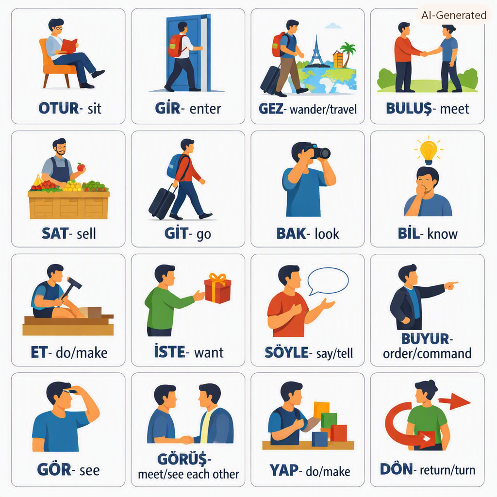

# Analysis of Verbs in Turkish Graded Readers for Foreigners

Based on the academic article "Yabancılar İçin Türkçe Okuma Kitaplarında Yer Alan Fiillerin İncelenmesi" (Investigation of Verbs in Turkish Graded Readers for Foreigners), here is a comprehensive breakdown:

---

## 📊 Overview Statistics

| Level | Total Verbs (Tokens) | Distinct Verbs (Types) | New Verbs (from previous levels) |
|-------|----------------------|------------------------|-----------------------------------|
| **A1** | 37 | 17 | 17 |
| **A2** | 2,291 | 362 | 348 |
| **B1** | 4,479 | 520 | 289 |
| **B2** | 5,092 | 654 | 295 |
| **C1** | 5,483 | 557 | 144 |
| **TOTAL** | **17,382** | **1,093** | - |

---

## 🟢 A1 Level Verbs (17 verbs)

The most frequently used verbs at A1 level (with frequency):

| Turkish Verb | English Translation | Frequency |
|--------------|---------------------|-----------|
| git- | go | 5 |
| bak- | look | 4 |
| bil- | know | 4 |
| et- | do/make | 3 |
| iste- | want | 3 |
| söyle- | say/tell | 3 |
| buyur- | order/command | 3 |
| gör- | see | 2 |
| görüş- | meet/see each other | 2 |
| yap- | do/make | 1 |
| al- | take/buy | 1 |
| dön- | return/turn | 1 |
| otur- | sit | 1 |
| gir- | enter | 1 |
| gez- | wander/travel | 1 |
| buluş- | meet | 1 |
| sat- | sell | 1 |
---

---

## 🟡 A2 Level Verbs (348 new verbs)

The most frequently used **new** verbs introduced at A2 level (with frequency):

| Turkish Verb | English Translation | Frequency |
|--------------|---------------------|-----------|
| başar- | succeed | 529 |
| ol- | be/become | 131 |
| gel- | come | 64 |
| ver- | give | 51 |
| başla- | start/begin | 33 |
| oku- | read | 31 |
| kal- | stay | 28 |
| ye- | eat | 28 |
| geç- | pass | 27 |
| konuş- | speak/talk | 27 |
| düşün- | think | 24 |
| sor- | ask | 21 |
| de- | say | 18 |
| anlat- | tell/narrate | 17 |
| bul- | find | 16 |
| çalış- | work/study | 16 |
| getir- | bring | 16 |
| çık- | go out/exit | 15 |
| gül- | laugh/smile | 14 |
| i- | drink (from iç-) | 13 |
| duy- | hear | 13 |
| tanı- | know/recognize | 13 |
| bitir- | finish | 13 |
| şaşır- | be surprised | 12 |
| anla- | understand | 11 |
| çek- | pull/draw | 10 |
| öldür- | kill | 10 |
| çıkar- | take out/remove | 10 |
| dur- | stop/stand | 9 |
| koş- | run | 9 |
| davran- | behave | 9 |
| harca- | spend | 9 |
| bekle- | wait | 8 |
| bırak- | leave/let go | 8 |
| bulun- | be found/exist | 8 |
| çağır- | call | 8 |
| hazırla- | prepare | 8 |
| kazan- | win/earn | 8 |

---

## 🔵 A2 Level Verbs (continued - more new verbs)

| Turkish Verb | English Translation | Frequency |
|--------------|---------------------|-----------|
| yaşa- | live | 8 |
| öl- | die | 7 |
| bağır- | shout | 7 |
| dinle- | listen | 7 |
| gerek- | be necessary | 7 |
| göster- | show | 7 |
| seç- | choose | 7 |
| an- | remember/mention | 7 |
| üzül- | be sad/worried | 6 |
| kalk- | get up | 6 |
| yürü- | walk | 6 |
| ara- | search/look for | 6 |
| ağla- | cry | 5 |
| sev- | love/like | 5 |
| uyu- | sleep | 5 |
| düş- | fall | 5 |
| aç- | open | 5 |
| kaç- | run away/escape | 5 |
| at- | throw | 5 |
| gönder- | send | 5 |
| tut- | hold | 5 |
| kaybet- | lose | 5 |
| öğren- | learn | 5 |
| koy- | put/place | 5 |
| san- | think/suppose | 5 |
| kaldır- | lift/remove | 5 |
| kes- | cut | 5 |
| art- | increase | 5 |
| çal- | play (instrument)/steal | 5 |
| zıpla- | jump | 5 |

---

## 📘 Other Notable A2 Verbs

| Turkish Verb | English Translation |
|--------------|---------------------|
| sür- | drive/continue |
| bit- | end/finish |
| kurtul- | get rid of/escape |
| görün- | appear/seem |
| in- | descend/get off |
| karşıla- | encounter/meet |
| yaz- | write |
| geçir- | spend (time)/pass |
| sun- | present/offer |
| seslen- | call out |
| taşı- | carry |
| ak- | flow |
| öp- | kiss |
| utan- | be ashamed |
| dile- | wish/request |
| göm- | bury |
| teşekkür et- | thank |
| katıl- | join/participate |
| dayan- | endure/resist |
| dene- | try/attempt |
| rastla- | encounter |
| kop- | break/tear |
| koyul- | start/engage in |
| benze- | resemble |
| selamla- | greet |
| kıskan- | envy/jealous |
| den- | be called |
| ispat et- | prove |
| yedir- | feed |
| söylen- | be said/mutter |
| alın- | be taken/offended |
| isten- | be wanted |
| yönel- | turn towards |
| aydınlat- | illuminate/clarify |
| bilin- | be known |
| asıl- | hang/be hanged |
| doy- | be full/satisfied |
| öfkelen- | get angry |
| süpür- | sweep |
| yara- | wound/injure |

---

## 📝 Key Findings

1. **A1 Level**: Only 17 basic verbs appear, focusing on everyday actions (go, see, want, say, etc.)

2. **A2 Level**: 348 new verbs are introduced, showing a significant expansion in vocabulary. The most frequent is **başar-** (succeed) appearing 529 times.

3. **Common verbs across all levels**: 
   - **git-** (go)
   - **iste-** (want) 
   - **gör-** (see)
   - **gel-** (come)
   - **ol-** (be/become)
   - **yap-** (do/make)

4. **A2 Level introduces**:
   - Action verbs: *koş-* (run), *zıpla-* (jump), *yürü-* (walk)
   - Communication verbs: *konuş-* (speak), *sor-* (ask), *anlat-* (tell), *bağır-* (shout)
   - Cognitive verbs: *düşün-* (think), *anla-* (understand), *öğren-* (learn)
   - Daily life verbs: *oku-* (read), *ye-* (eat), *kal-* (stay), *uyu-* (sleep)

---

## 💡 Study Tips for A1-A2 Verbs

1. **Start with A1 verbs** - these are the most essential (17 verbs)
2. **Master the top 20 A2 verbs** before moving to others
3. **Group by category**:
   - **Movement**: git-, gel-, dön-, gir-, çık-
   - **Communication**: söyle-, konuş-, anlat-, sor-
   - **Daily actions**: yap-, et-, al-, ver-, oku-
   - **Feelings**: gör-, duy-, sev-, üzül-

---

> **Note**: This data comes from a scientific study analyzing 8 graded readers published by Erdem Yayınları across all CEFR levels (A1-C1). The verb roots are shown without tense/person suffixes.