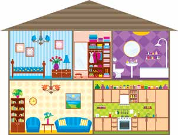

.
10 Resme bakalım. Nesneleri
yazalım.
Burası ev. Şurası salon. Bu koltuk.
YAZMA
---

Vocabulary from the Image:
Rooms (Odalar):
Ev - House
Salon - Living room
Yatak odası - Bedroom
Mutfak - Kitchen
Banyo - Bathroom
Objects (Nesneler):
Koltuk - Sofa
Yatak - Bed
Lamba - Lamp
Çiçek - Flower
Lavabo - Sink
Ayna - Mirror
Tuvalet - Toilet
Buzdolabı - Refrigerator
Fırın - Oven/Stove
Kitaplık - Bookshelf
Saat - Clock
Masa - Table
Kıyafet - Clothes
Raf - Shelf

---

- Burasi ev. Surasi salon. Bu koltuk
- Burasi yatak odasi. Bu yatak. Su lamba. Bu cicek.
- Surasi banyo. Bu lavabo. Su ayna. Bu tuvalet.
- Orasi mutfak. Bu buzdolabi. Su firin . Bu lavabo.
- Burasi gardirop. Su kiyafetler. Bu raflar.
- Surasi salon. Bu kitaplik. Su saat . Bu masa

---

---

### ✍️ Part 3: What We Learned? (Neler Öğrendik?) - *With Answers*

#### 1. Match the sentences (Aşağıdaki cümleleri eşleştirelim)
*   **1. Nasılsın?** (How are you?) ➡️ **b. İyiyim.** (I am fine.)
*   **2. Nerelisin?** (Where are you from?) ➡️ **c. Ankaralıyım.** (I am from Ankara.)
*   **3. Görüşürüz.** (See you.) ➡️ **a. Görüşmek üzere.** (See you soon / Talk to you later.)
*   **4. Ne iş yapıyorsun?** (What do you do for a living?) ➡️ **ç. Ben öğrenciyim.** (I am a student.)
*   **5. Merhaba!** (Hello!) ➡️ **d. Merhaba!** (Hello!)

#### 2. Choose the correct option (Doğru seçeneği işaretleyelim)
1. Ahmet: ........................... / Lale: İyiyim. Teşekkür ederim. 
   * **Answer: c. Nasılsın?** (How are you?)
2. Serkan: Adınız ne? (What is your name?) / Fatma: ...........................
   * **Answer: b. Benim adım Fatma.** (My name is Fatma.)
3. İrem: Memnun oldum. (Nice to meet you.) / Hande: ...........................
   * **Answer: a. Ben de memnun oldum.** (Nice to meet you, too.)
4. Özcan: Benim adım Özcan. Senin adın ne? / Sena: ........................... / Özcan: Memnun oldum. / Sena: ...........................
   * **Answer: b. Benim adım Sena. / Ben de memnun oldum.** (My name is Sena. / Nice to meet you, too.)
5. İlker: Nasılsın? / Selma: ........................... / İlker: Ben de iyiyim. Teşekkür ederim.
   * **Answer: a. İyiyim. Sen?** (I'm fine. And you?)

#### 3. Make the words plural (Aşağıdaki kelimeleri çoğul yapalım)
*Rule: Use **-lar** for a, ı, o, u. Use **-ler** for e, i, ö, ü.*
*   Masa ➡️ **Masalar**
*   Kalem ➡️ **Kalemler**
*   Sandalye ➡️ **Sandalyeler**
*   Vazo ➡️ **Vazolar**
*   Öğrenci ➡️ **Öğrenciler**
*   Öğretmen ➡️ **Öğretmenler**
*   Saat ➡️ **Saatler**
*   Kitap ➡️ **Kitaplar**
*   Silgi ➡️ **Silgiler**
*   Sözlük ➡️ **Sözlükler**
*   Okul ➡️ **Okullar**
*   Sınıf ➡️ **Sınıflar**

#### 4. True (D - Doğru) or False (Y - Yanlış)
*   Bu ne? Bu öğretmen. ➡️ **( Y )** *False. Should be "Bu **kim**?" (Who is this?)*
*   Saatler ➡️ **( D )** *True. Correct plural of saat.*
*   Üç kalemler ➡️ **( Y )** *False. In Turkish, if a specific number is used, the noun stays singular: "Üç kalem".*
*   Burası okul. ➡️ **( D )** *True.*
*   Bu sınıf mu? ➡️ **( Y )** *False. Vowel harmony: "Bu sınıf **mı**?"*
*   Bunlar kitap. ➡️ **( Y )** *False. Should be "Bunlar kitap**lar**" (These are books) or "Bu kitap" (This is a book).*
*   Nasılsın? Fransalıyım. ➡️ **( Y )** *False. Mismatched question and answer.*
*   Bu kim? Bu Ali. ➡️ **( D )** *True.*
*   Şunlar masalar. ➡️ **( D )** *True.*

#### 5. Unscramble the Countries (Ülkeleri yazalım)
*   ü r T i k e y ➡️ **Türkiye** (Turkey)
*   İ a t l a y İ ➡️ **İtalya** (Italy)
*   u R s a y R ➡️ **Rusya** (Russia)
*   ırMsı M ➡️ **Mısır** (Egypt)
*   n g e İ l i t r e İ ➡️ **İngiltere** (England / UK)
*   o K e r K ➡️ **Kore** (Korea)
*   a n y a A l m A ➡️ **Almanya** (Germany)

#### 6. Match the phrase to the situation (Nerede, ne zaman, ne söylüyoruz?)
*   **LOKANTA** (Restaurant): **a) Afiyet olsun!** (Bon appétit!)
*   **GECE** (Night): **c) İyi geceler!** (Good night!)
*   **HASTANE** (Hospital): **b) Geçmiş olsun!** (Get well soon!)
*   **DOĞUM GÜNÜ** (Birthday): **a) Mutlu yıllar!** (Happy birthday / Many happy years!)

---

### 💡 Pro-Tip for Turkish Learners:
Notice the rule in Exercise 4: **"Üç kalem"** (Three pens), NOT "Üç kalemler". In Turkish, **when a specific number precedes a noun, the noun remains singular**. The plural concept is already carried by the number. 
* *Correct:* İki araba (Two cars)
* *Incorrect:* İki arabalar