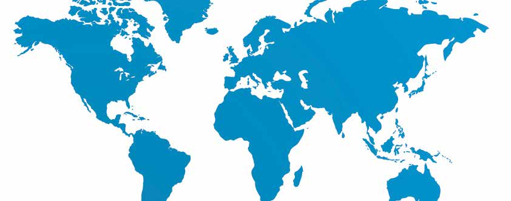

This page is a **Review and Self-Assessment (Öz Değerlendirme)** section from an A1 Turkish textbook. It covers classroom language, basic greetings, plurals, and country names. 

Below is a complete breakdown of the page, including translations, explanations, and **the correct answers to all the exercises**.

---

### 🏫 Part 1: Classroom Language (Sınıf Dili)
**Dialogue Translation & Key Phrases:**
*   **Magda:** *Affedersiniz.* (Excuse me.)
*   **Öğretmen:** *Evet, Magda.* (Yes, Magda.)
*   **Magda:** *Soru ne demek?* (What does "soru" [question] mean?)
*   **Öğretmen:** *Ben soru soruyorum. Sen cevap veriyorsun.* (I am asking a question. You are answering.)
*   **Magda:** *Üzgünüm. Anlamıyorum.* (I'm sorry. I don't understand.)
*   **Öğretmen:** *Tamam. Soru: Senin adın ne? Cevap: Benim adım Magda.* (Okay. Question: What is your name? Answer: My name is Magda.)
*   **Magda:** *Tamam. Anladım. Teşekkürler.* (Okay. I understood. Thank you.)

**Word Search Words:** merhaba (hello), iyi (good), bu (this), şu (that), o (that/it), kim (who), ne (what), kalem (pen), masa (table).

---

### 📊 Part 2: Self-Assessment (Öz Değerlendirme)
*Rate yourself from 1 (I can't do it) to 5 (I can do it very well).*
1. **Bir kişiyle tanışabilirim.** (I can introduce myself to a person.)
2. **Adımı, soyadımı, ülkemi söyleyebilirim.** (I can say my name, surname, and country.)
3. **Nesneleri ve kişileri sorabilirim.** (I can ask about objects and people.)
4. **Nesnelerin yerini sorabilirim ve söyleyebilirim.** (I can ask about and state the location of objects.)

---
